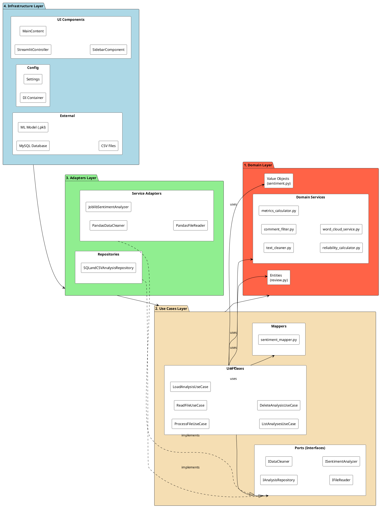
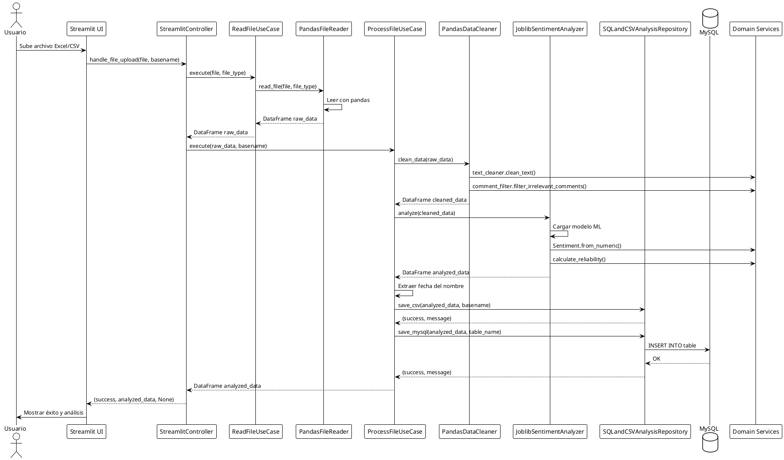
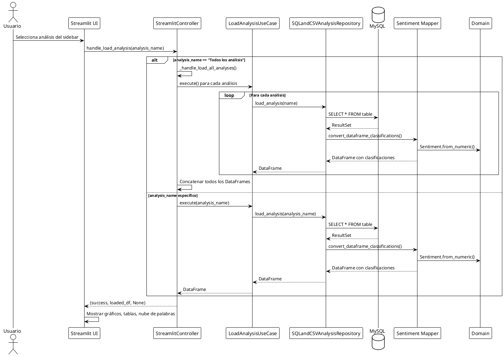
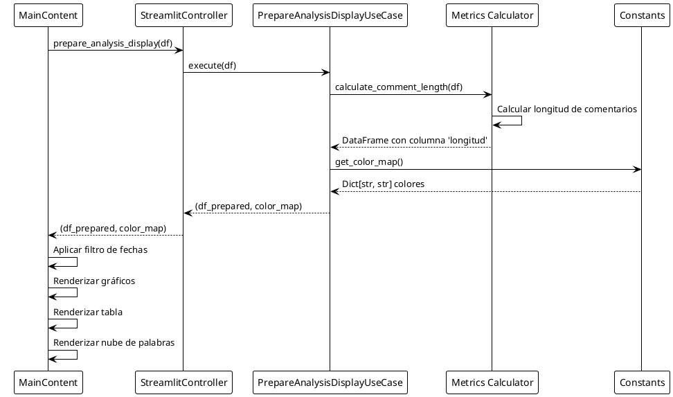
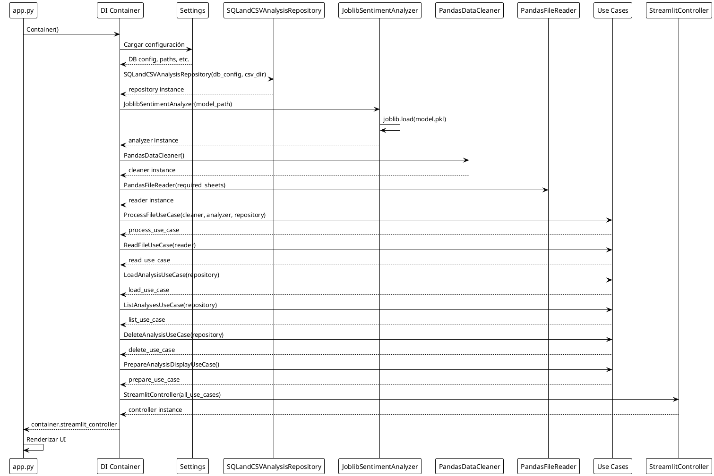

# Documentación Completa de Arquitectura - Gestor de Satisfacción y Seguimiento de Posventa [GSSP]

## Tabla de Contenidos

1. [Introducción](#introducción)
2. [Principios de Arquitectura](#principios-de-arquitectura)
3. [Estructura de Capas](#estructura-de-capas)
4. [Capa de Dominio](#capa-de-dominio)
5. [Capa de Casos de Uso](#capa-de-casos-de-uso)
6. [Capa de Adaptadores](#capa-de-adaptadores)
7. [Capa de Infraestructura](#capa-de-infraestructura)
8. [Diagramas de Alto Nivel](#diagramas-de-alto-nivel)
9. [Diagramas de Secuencia](#diagramas-de-secuencia)
10. [Flujo de Datos](#flujo-de-datos)

---

## Introducción

El **Gestor de Satisfacción y Seguimiento de Posventa (GSSP)** es una aplicación web construida con **Streamlit** que permite analizar comentarios de clientes mediante análisis de sentimientos usando Machine Learning.

La aplicación sigue los principios de **Arquitectura Limpia (Clean Architecture)**, garantizando:
- **Independencia de frameworks**: El dominio no depende de tecnologías externas
- **Testabilidad**: Cada capa puede probarse independientemente
- **Mantenibilidad**: Cambios en una capa no afectan otras
- **Escalabilidad**: Fácil agregar nuevas funcionalidades

---

## Principios de Arquitectura

### Regla de Dependencias

Las dependencias siempre apuntan **hacia adentro**:

```
Infrastructure → Adapters → Use Cases → Domain
```

- **Infrastructure** puede depender de **Adapters**
- **Adapters** pueden depender de **Use Cases** y **Domain**
- **Use Cases** pueden depender de **Domain**
- **Domain** NO depende de nada (es la capa más interna)

### Inversión de Dependencias

Los casos de uso dependen de **abstracciones (puertos/interfaces)**, no de implementaciones concretas. Los adaptadores implementan estas interfaces.

---

## Estructura de Capas

```
src/
├── domain/              # 1. DOMINIO - Reglas de negocio puras
├── use_cases/           # 2. CASOS DE USO - Lógica de aplicación
├── adapters/            # 3. ADAPTADORES - Implementaciones concretas
└── infrastructure/      # 4. INFRAESTRUCTURA - Detalles técnicos
```

---

## Capa de Dominio

### Propósito

La capa de dominio contiene las **reglas de negocio puras** y es completamente independiente de frameworks externos. Es la capa más interna y estable.

### Estructura

```
src/domain/
├── entities/              # Entidades del dominio
│   └── review.py          # Review, AnalyzedReview
├── value_objects/         # Objetos de valor inmutables
│   └── sentiment.py       # Sentiment enum (Detractor, Neutro, Promotor)
└── services/              # Servicios de dominio (lógica reutilizable)
    ├── text_cleaner.py    # Limpieza de texto
    ├── comment_filter.py  # Filtrado de comentarios irrelevantes
    ├── metrics_calculator.py  # Cálculo de métricas
    ├── reliability_calculator.py  # Cálculo de fiabilidad
    └── word_cloud_service.py  # Generación de corpus para nubes de palabras
```

### Módulos y Archivos

#### `entities/review.py`

**Propósito**: Define las entidades del dominio que representan reseñas de clientes.

**Clases**:
- `Review`: Representa una reseña antes del análisis
  - `comment: str` - Texto del comentario
  - `rating: int` - Calificación numérica
  
- `AnalyzedReview(Review)`: Representa una reseña después del análisis
  - Hereda de `Review`
  - `sentiment: Sentiment` - Clasificación de sentimiento

**Características**:
- Usa `@dataclass(frozen=True)` para inmutabilidad
- Depende solo de `Sentiment` value object

#### `value_objects/sentiment.py`

**Propósito**: Define el objeto de valor `Sentiment` que representa las clasificaciones de sentimiento.

**Valores**:
- `DETRACTOR = "Detractor"` (valor numérico: -1)
- `NEUTRAL = "Neutro"` (valor numérico: 0)
- `PROMOTOR = "Promotor"` (valor numérico: 1)

**Métodos**:
- `from_numeric(value: int) -> Sentiment`: Convierte valor numérico a enum
- `from_string(value: str) -> Sentiment`: Convierte string a enum

#### `services/text_cleaner.py`

**Propósito**: Encapsula la lógica de limpieza de texto.

**Función**:
- `clean_text(text: str) -> str | None`: Limpia texto (minúsculas, sin acentos, sin puntuación)

**Características**:
- Independiente de frameworks (solo usa stdlib)
- Lógica de negocio pura

#### `services/comment_filter.py`

**Propósito**: Define qué comentarios se consideran irrelevantes.

**Funciones**:
- `get_irrelevant_patterns() -> List[str]`: Retorna patrones regex para filtrar
- `filter_irrelevant_comments(df: pd.DataFrame) -> pd.DataFrame`: Filtra comentarios

**Nota**: Usa pandas, pero es una dependencia técnica aceptada para proyectos de análisis de datos.

#### `services/metrics_calculator.py`

**Propósito**: Calcula métricas de análisis (longitud, resúmenes).

**Funciones**:
- `calculate_comment_length(df: pd.DataFrame) -> pd.DataFrame`: Calcula longitud de comentarios
- `calculate_summary_metrics(df: pd.DataFrame) -> pd.DataFrame`: Genera resumen por clasificación

#### `services/reliability_calculator.py`

**Propósito**: Calcula la fiabilidad de las predicciones de sentimiento.

**Funciones**:
- `calculate_reliability_from_probability(probability: float) -> float`
- `calculate_reliability_from_rating(rating: Union[int, float]) -> str`

#### `services/word_cloud_service.py`

**Propósito**: Prepara texto para generación de nubes de palabras.

**Funciones**:
- `get_custom_stopwords() -> Set[str]`: Stopwords personalizadas
- `normalize_comment(comment: str) -> str`: Normaliza comentarios
- `build_corpus(comentarios: Iterable[str]) -> str`: Construye corpus
- `get_stopwords() -> Set[str]`: Stopwords completas (custom + STOPWORDS)

---

## Capa de Casos de Uso

### Propósito

La capa de casos de uso contiene la **lógica de aplicación** que orquesta las operaciones del negocio. Define **qué** hace la aplicación, no **cómo** lo hace.

### Estructura

```
src/use_cases/
├── ports/                    # Interfaces (Puertos) - Abstracciones
│   ├── analysis_repository.py        # IAnalysisRepository
│   ├── data_cleaner.py               # IDataCleaner
│   ├── file_reader.py                # IFileReader
│   ├── sentiment_analyzer.py         # ISentimentAnalyzer
│   └── report_repository.py          # IReportRepository
├── mappers/                  # Mappers - Conversión entre representaciones
│   └── sentiment_mapper.py   # Convierte numéricos a Sentiment
├── process_file_use_case.py               # Procesar archivo completo
├── read_file_use_case.py                 # Leer archivo
├── load_analysis_use_case.py             # Cargar análisis guardado
├── list_analyses_use_case.py            # Listar análisis guardados
├── delete_analysis_use_case.py          # Eliminar análisis
├── prepare_analysis_display_use_case.py # Preparar para visualización
├── generate_summary_use_case.py         # Generar resumen
├── save_report_use_case.py              # Guardar metadatos de reporte
├── list_reports_use_case.py             # Listar historial de reportes
├── clear_reports_history_use_case.py    # Limpiar historial de reportes
└── delete_report_use_case.py            # Eliminar un reporte del historial
```

### Puertos (Interfaces)

#### `ports/analysis_repository.py`

**Interfaz**: `IAnalysisRepository`

**Métodos**:
- `save_csv(data: pd.DataFrame, file_name: str) -> Tuple[bool, str]`
- `save_mysql(data: pd.DataFrame, table_name: str) -> Tuple[bool, str]`
- `list_analyses() -> List[str]`
- `load_analysis(name: str) -> pd.DataFrame`
- `delete_analysis(name: str) -> Tuple[bool, str]`

**Propósito**: Define cómo se persisten y recuperan los análisis.

#### `ports/data_cleaner.py`

**Interfaz**: `IDataCleaner`

**Métodos**:
- `clean_data(raw_data: pd.DataFrame) -> pd.DataFrame`

**Propósito**: Define cómo se limpian los datos.

#### `ports/file_reader.py`

**Interfaz**: `IFileReader`

**Métodos**:
- `read_file(file_object, file_type: str) -> pd.DataFrame`

**Propósito**: Define cómo se leen archivos.

#### `ports/sentiment_analyzer.py`

**Interfaz**: `ISentimentAnalyzer`

**Métodos**:
- `analyze(data: pd.DataFrame) -> pd.DataFrame`

**Propósito**: Define cómo se analiza el sentimiento.

#### `ports/report_repository.py`

**Interfaz**: `IReportRepository`

**Métodos**:
- `save(analysis_name, report_format, file_path, ...) -> Tuple[bool, str]`
- `list() -> List[dict]`
- `get(report_id: int) -> Optional[dict]`
- `delete(report_id: int) -> Tuple[bool, str]`
- `clear() -> Tuple[bool, str]`

**Propósito**: Gestiona el historial de reportes (metadatos y vínculo a archivo).

### Casos de Uso

#### `process_file_use_case.py`

**Clase**: `ProcessFileUseCase`

**Propósito**: Orquesta el procesamiento completo de un archivo:
1. Limpia los datos
2. Analiza el sentimiento
3. Extrae fecha del nombre del archivo
4. Guarda en CSV y MySQL

**Dependencias**:
- `IDataCleaner`
- `ISentimentAnalyzer`
- `IAnalysisRepository`

#### `read_file_use_case.py`

**Clase**: `ReadFileUseCase`

**Propósito**: Lee un archivo CSV o Excel y lo convierte a DataFrame.

**Dependencias**:
- `IFileReader`

#### `load_analysis_use_case.py`

**Clase**: `LoadAnalysisUseCase`

**Propósito**: Carga un análisis guardado por su nombre.

**Dependencias**:
- `IAnalysisRepository`

#### `list_analyses_use_case.py`

**Clase**: `ListAnalysesUseCase`

**Propósito**: Lista todos los análisis guardados.

**Dependencias**:
- `IAnalysisRepository`

#### `delete_analysis_use_case.py`

**Clase**: `DeleteAnalysisUseCase`

**Propósito**: Elimina uno o múltiples análisis.

**Dependencias**:
- `IAnalysisRepository`

#### `prepare_analysis_display_use_case.py`

**Clase**: `PrepareAnalysisDisplayUseCase`

**Propósito**: Prepara datos para visualización (calcula longitudes, obtiene colores).

**Dependencias**:
- Servicios de dominio (`metrics_calculator`)
- Constantes de UI (`get_color_map`)

#### `generate_summary_use_case.py`

**Clase**: `GenerateSummaryUseCase`

**Propósito**: Genera resumen de métricas agrupadas por clasificación.

**Dependencias**:
- Servicios de dominio (`metrics_calculator`)

#### `save_report_use_case.py`

**Clase**: `SaveReportUseCase`

**Propósito**: Persiste metadatos de un reporte generado (ruta, formato, análisis).

**Dependencias**:
- `IReportRepository`

#### `list_reports_use_case.py`

**Clase**: `ListReportsUseCase`

**Propósito**: Lista el historial de reportes con sus metadatos.

**Dependencias**:
- `IReportRepository`

#### `clear_reports_history_use_case.py`

**Clase**: `ClearReportsHistoryUseCase`

**Propósito**: Limpia el historial y elimina archivos asociados.

**Dependencias**:
- `IReportRepository`

#### `delete_report_use_case.py`

**Clase**: `DeleteReportUseCase`

**Propósito**: Elimina un reporte específico por id (solo su fila y archivo).

**Dependencias**:
- `IReportRepository`

### Mappers

#### `mappers/sentiment_mapper.py`

**Propósito**: Convierte entre representaciones numéricas y de dominio de sentimientos.

**Funciones**:
- `convert_numeric_to_sentiment(value) -> str`: Convierte número a string
- `convert_dataframe_classifications(df: pd.DataFrame) -> pd.DataFrame`: Convierte columna completa

**Ubicación**: Está en `use_cases/mappers/` porque trabaja con pandas (representación técnica) y lo convierte a dominio.

---

## Capa de Adaptadores

### Propósito

Los adaptadores **implementan los puertos** definidos en la capa de casos de uso. Traducen entre el dominio y las tecnologías externas.

### Estructura

```
src/adapters/
├── data_cleaner_adapter.py          # PandasDataCleaner (IDataCleaner)
├── sentiment_analyzer_adapter.py   # JoblibSentimentAnalyzer (ISentimentAnalyzer)
├── file_readers/
│   └── file_reader_adapter.py      # PandasFileReader (IFileReader)
└── repositories/
    ├── analysis_repository_adapter.py  # SQLandCSVAnalysisRepository (IAnalysisRepository)
    └── report_repository_adapter.py    # SQLReportRepository (IReportRepository)
```

### Adaptadores

#### `data_cleaner_adapter.py`

**Clase**: `PandasDataCleaner`

**Implementa**: `IDataCleaner`

**Propósito**: Limpia datos usando pandas y servicios de dominio.

**Características**:
- Usa `text_cleaner.clean_text()` del dominio
- Usa `comment_filter.filter_irrelevant_comments()` del dominio
- Normaliza columnas de fecha
- Estandariza nombres de columnas

#### `sentiment_analyzer_adapter.py`

**Clase**: `JoblibSentimentAnalyzer`

**Implementa**: `ISentimentAnalyzer`

**Propósito**: Analiza sentimiento usando un modelo ML cargado con joblib.

**Características**:
- Carga modelo `.pkl` con joblib
- Convierte predicciones numéricas a `Sentiment` value objects
- Calcula fiabilidad usando servicios de dominio
- Agrega columna `Fiabilidad` al DataFrame

#### `file_readers/file_reader_adapter.py`

**Clase**: `PandasFileReader`

**Implementa**: `IFileReader`

**Propósito**: Lee archivos CSV y Excel usando pandas.

**Características**:
- Soporta CSV y Excel
- Valida hojas requeridas en Excel
- Retorna DataFrame de pandas

#### `repositories/analysis_repository_adapter.py`

**Clase**: `SQLandCSVAnalysisRepository`

**Implementa**: `IAnalysisRepository`

**Propósito**: Persiste análisis en MySQL y CSV.

**Características**:
- Guarda en MySQL usando `mysql.connector`
- Guarda en CSV usando pandas
- Carga desde MySQL
- Usa mapper para convertir clasificaciones numéricas a texto
- Lista tablas de análisis
- Elimina análisis (tablas y archivos CSV)

#### `repositories/report_repository_adapter.py`

**Clase**: `SQLReportRepository`

**Implementa**: `IReportRepository`

**Propósito**: Gestiona el historial de reportes en MySQL y la vida de archivos en disco.

**Características**:
- `save` inserta metadatos con `created_at`.
- `list` devuelve filas ordenadas por `created_at DESC`.
- `delete` elimina un único reporte por `id` y su archivo asociado.
- `clear` borra todos los archivos listados y trunca la tabla.

---

## Capa de Infraestructura

### Propósito

La capa de infraestructura contiene los **detalles técnicos** de implementación: UI, configuración, modelos ML, y el contenedor de inyección de dependencias.

### Estructura

```
src/infrastructure/
├── config.py                        # Configuración (Settings)
├── dependency_injection_container.py # Contenedor DI
├── ML/
│   └── clasificador_sentimiento_final.pkl  # Modelo ML
└── ui/
    ├── config.py                    # Configuración de página Streamlit
    ├── constants.py                 # Constantes y get_color_map()
    ├── controllers/
    │   └── streamlit_controller.py  # Controlador principal
    ├── components/                  # Componentes UI
    │   ├── analysis_state_manager.py
    │   ├── charts_component.py
    │   ├── delete_analysis_component.py
    │   ├── export_component.py
    │   ├── report_history_component.py
    │   ├── file_upload_component.py
    │   ├── main_content.py
    │   ├── sidebar_component.py
    │   ├── table_component.py
    │   └── word_cloud_component.py
    ├── export.py                    # Exportación a Excel
    ├── export_pdf.py               # Exportación a PDF
    ├── sidebar.py                   # Wrapper del sidebar
    ├── charts.py                   # Funciones de gráficos (legacy)
    └── tables.py                   # Funciones de tablas (legacy)
```

### Módulos Clave

#### `config.py`

**Clase**: `Settings`

**Propósito**: Carga y gestiona configuración desde variables de entorno.

**Configuraciones**:
- `DB_HOST`, `DB_USER`, `DB_PASSWORD`, `DB_NAME`
- `EXCEL_REQUIRED_SHEETS`
- `CSV_BASE_DIR`
- `APP_TITLE`

#### `dependency_injection_container.py`

**Clase**: `Container`

**Propósito**: Crea y conecta todas las dependencias de la aplicación.

**Responsabilidades**:
- Crea adaptadores concretos
- Crea casos de uso con dependencias inyectadas
- Crea controlador con casos de uso inyectados
- Expone instancia global `container`

**Flujo de Creación**:
1. Crea adaptadores (repositorio, analizador, limpiador, lector)
2. Crea casos de uso con adaptadores inyectados
3. Crea controlador con casos de uso inyectados

#### `ui/controllers/streamlit_controller.py`

**Clase**: `StreamlitController`

**Propósito**: Orquesta la interacción entre la UI y los casos de uso.

**Métodos**:
- `handle_file_upload()`: Procesa archivo subido
- `handle_load_analysis()`: Carga análisis guardado
- `get_saved_analyses()`: Lista análisis guardados
- `handle_delete_analysis()`: Elimina análisis
- `prepare_analysis_display()`: Prepara datos para visualización
- `_handle_load_all_analyses()`: Carga y consolida todos los análisis
 - `handle_send_email()`: Envía reporte por correo
 - `handle_save_report()`: Guarda reporte en historial
 - `get_report_history()`: Lista historial de reportes
 - `clear_report_history()`: Limpia historial
 - `delete_report(report_id)`: Elimina un reporte específico

#### `ui/components/`

**Propósito**: Componentes UI modulares que renderizan diferentes partes de la interfaz.

**Componentes**:
- `MainContent`: Contenido principal de la página
- `SidebarComponent`: Barra lateral con controles
- `ChartsComponent`: Gráficos de análisis
- `TableComponent`: Tabla de comentarios
- `WordCloudComponent`: Nube de palabras
- `ExportComponent`: Botones de exportación
 - `ReportHistoryComponent`: Historial con descarga y eliminación por fila
- `FileUploadComponent`: Carga de archivos
- `DeleteAnalysisComponent`: Eliminación de análisis
- `AnalysisStateManager`: Gestión de estado de Streamlit

#### `ui/constants.py`

**Constantes**:
- `ALL_ANALYSES_OPTION = "Todos los análisis"`

**Funciones**:
- `get_color_map() -> dict[str, str]`: Mapa de colores para UI

---

## Diagramas de Alto Nivel

### Diagrama de Arquitectura General



### Diagrama de Componentes por Capa

```plantuml
@startuml Componentes_por_Capa
!theme plain
skinparam component {
    BackgroundColor #FFF
    BorderColor #333
}

package "Domain" #Tomato {
    component [Review Entity] as Review
    component [Sentiment VO] as Sentiment
    component [Text Cleaner] as TextCleaner
    component [Comment Filter] as CommentFilter
    component [Metrics Calculator] as MetricsCalc
    component [Reliability Calculator] as ReliabilityCalc
    component [Word Cloud Service] as WordCloudSvc
}

package "Use Cases" #Wheat {
    component [ProcessFileUseCase] as ProcessUC
    component [ReadFileUseCase] as ReadUC
    component [LoadAnalysisUseCase] as LoadUC
    component [ListAnalysesUseCase] as ListUC
    component [DeleteAnalysisUseCase] as DeleteUC
    component [PrepareDisplayUseCase] as PrepareUC
    component [Sentiment Mapper] as SentimentMapper
}

package "Ports" #Gold {
    interface IAnalysisRepository
    interface IDataCleaner
    interface IFileReader
    interface ISentimentAnalyzer
}

package "Adapters" #LightGreen {
    component [SQLandCSVAnalysisRepository] as SQLRepo
    component [PandasDataCleaner] as PandasCleaner
    component [PandasFileReader] as PandasReader
    component [JoblibSentimentAnalyzer] as JoblibAnalyzer
}

package "Infrastructure" #LightBlue {
    component [StreamlitController] as Controller
    component [DI Container] as DIContainer
    component [MainContent] as MainContent
    component [Settings] as Settings
}

' Dependencias
ProcessUC --> IDataCleaner
ProcessUC --> ISentimentAnalyzer
ProcessUC --> IAnalysisRepository
ReadUC --> IFileReader
LoadUC --> IAnalysisRepository
ListUC --> IAnalysisRepository
DeleteUC --> IAnalysisRepository

SQLRepo ..|> IAnalysisRepository
PandasCleaner ..|> IDataCleaner
PandasReader ..|> IFileReader
JoblibAnalyzer ..|> ISentimentAnalyzer

Controller --> ProcessUC
Controller --> ReadUC
Controller --> LoadUC
Controller --> ListUC
Controller --> DeleteUC
Controller --> PrepareUC

ProcessUC --> TextCleaner
ProcessUC --> CommentFilter
ProcessUC --> Sentiment
JoblibAnalyzer --> Sentiment
JoblibAnalyzer --> ReliabilityCalc
PandasCleaner --> TextCleaner
PandasCleaner --> CommentFilter
PrepareUC --> MetricsCalc
SQLRepo --> SentimentMapper
SentimentMapper --> Sentiment

DIContainer --> SQLRepo
DIContainer --> PandasCleaner
DIContainer --> PandasReader
DIContainer --> JoblibAnalyzer
DIContainer --> ProcessUC
DIContainer --> Controller

@enduml
```



---

## Diagramas de Secuencia

### Secuencia: Procesar Archivo Subido



### Secuencia: Cargar Análisis Guardado



### Secuencia: Preparar Visualización



### Secuencia: Eliminar Análisis

```plantuml
@startuml Secuencia_Eliminar_Analisis
!theme plain
actor Usuario
participant "DeleteAnalysisComponent" as DeleteComp
participant "StreamlitController" as Controller
participant "DeleteAnalysisUseCase" as DeleteUC
participant "SQLandCSVAnalysisRepository" as Repository
database "MySQL" as DB
file "CSV Files" as CSV

Usuario -> DeleteComp: Selecciona análisis y confirma eliminación
DeleteComp -> Controller: handle_delete_analysis(analysis_name)

Controller -> DeleteUC: execute(analysis_name)

DeleteUC -> Repository: delete_analysis(analysis_name)

Repository -> DB: DROP TABLE table_name
DB --> Repository: OK

Repository -> CSV: Eliminar archivo CSV
CSV --> Repository: OK

Repository --> DeleteUC: (success, message)
DeleteUC --> Controller: (success, message)
Controller --> DeleteComp: (success, message)
DeleteComp -> Usuario: Mostrar mensaje de éxito

@enduml
```

### Secuencia: Inicialización de la Aplicación



---

## Flujo de Datos

### Flujo General de la Aplicación

```
┌─────────────────────────────────────────────────────────────┐
│                    STREAMLIT UI                              │
│  ┌──────────────┐  ┌──────────────┐  ┌──────────────┐     │
│  │   Sidebar    │  │  MainContent │  │  Components  │     │
│  └──────┬───────┘  └──────┬───────┘  └──────┬───────┘     │
└─────────┼──────────────────┼──────────────────┼─────────────┘
          │                  │                  │
          └──────────────────┼──────────────────┘
                             │
                    ┌────────▼────────┐
                    │   Controller    │
                    └────────┬────────┘
                             │
          ┌──────────────────┼──────────────────┐
          │                  │                  │
    ┌─────▼─────┐    ┌───────▼──────┐   ┌──────▼──────┐
    │ ReadFile  │    │ ProcessFile  │   │ LoadAnalysis│
    │ UseCase   │    │ UseCase      │   │ UseCase     │
    └─────┬─────┘    └───────┬──────┘   └──────┬──────┘
          │                  │                  │
          │         ┌────────┼────────┐         │
          │         │        │        │         │
    ┌─────▼─────┐  │  ┌──────▼──────┐ │  ┌──────▼──────┐
    │ IFileReader│  │  │IDataCleaner │ │  │IAnalysisRepo│
    └─────┬─────┘  │  └──────┬──────┘ │  └──────┬──────┘
          │        │         │        │         │
          │        │  ┌──────▼──────┐ │         │
          │        │  │ISentiment   │ │         │
          │        │  │Analyzer     │ │         │
          │        │  └──────┬──────┘ │         │
          │        │         │        │         │
    ┌─────▼─────┐  │  ┌──────▼──────┐ │  ┌──────▼──────┐
    │PandasFile │  │  │PandasData   │ │  │SQLandCSV    │
    │Reader     │  │  │Cleaner      │ │  │Repository   │
    └───────────┘  │  └──────┬──────┘ │  └──────┬──────┘
                   │         │        │         │
                   │  ┌──────▼──────┐ │         │
                   │  │Joblib       │ │         │
                   │  │Sentiment    │ │         │
                   │  │Analyzer     │ │         │
                   │  └─────────────┘ │         │
                   │                  │         │
          ┌────────┴──────────────────┴─────────┘
          │
    ┌─────▼─────────────────────────────────────┐
    │         DOMAIN SERVICES                    │
    │  - text_cleaner                            │
    │  - comment_filter                          │
    │  - metrics_calculator                      │
    │  - reliability_calculator                  │
    │  - word_cloud_service                      │
    └────────────────────────────────────────────┘
```
